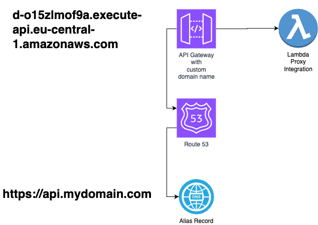

# API Gateway with Custom Domain and Route 53

#### Goal of the Project

The primary components of this projects includes a Lambda function exposed via API Gateway, and custom domain configuration with DNS management through Route 53. 



#### Key Components and Their Purpose

1. **AWS Lambda Function**: This function is responsible for executing the core logic of our application in response to HTTP requests, without the need to manage server infrastructure.

2. **API Gateway REST API**: Provides a robust and scalable interface to expose the Lambda function over the web. This API Gateway acts as a front door for requests to access the Lambda function.

3. **Custom Domain for API Gateway**: Enhances the accessibility and professionalism of our application by allowing it to be reached via a custom domain name, rather than the default URL provided by API Gateway.

4. **Route 53 DNS Record**: Integrates with the API Gateway's custom domain, ensuring that the application can be reliably accessed through the custom domain name (`api.example.com`). This DNS setup is crucial for easy discovery and consistent access to the service.

## Resources Created

### AWS Lambda Function

- **Resource Name**: `MyLambda`
- **Description**: A simple Lambda function.
- **Runtime**: Node.js 14.x
- **Handler**: `index.handler`
- **Code Source**: Local directory (specified in the stack).

### API Gateway REST API

- **Resource Name**: `MyApi`
- **Description**: An API Gateway REST API to expose the Lambda function.
- **RestApiName**: `MyService`
- **Resource**: `/myresource`
- **Method**: ANY (All HTTP methods are routed to the Lambda function).

### Custom Domain for API Gateway

- **Resource Name**: `CustomDomain`
- **Domain Name**: Specified in the stack (e.g., `example.com`).
- **Certificate**: ACM certificate specified in the stack.
- **Association**: Domain is associated with the default stage of the API.

### Route 53 DNS Record

- **Resource Name**: `APIGatewayAliasRecord`
- **Record Type**: A Record
- **Domain**: `api.example.com`
- **Target**: Custom domain of the API Gateway.

## Deployment

To deploy these resources, ensure AWS CLI is configured with the correct permissions and run:

```bash
cdk deploy
```

## Prerequisites

- AWS CLI configured with appropriate credentials.
- Node.js and npm installed.
- AWS CDK installed globally: `npm install -g aws-cdk`.
- Necessary CDK packages installed as described in `package.json`.

## Notes

- Replace placeholders in the CDK stack with actual values (like Lambda code path, domain names, certificate ARN).
- Ensure that a Route 53 hosted zone is set up for the specified domain.
- Review AWS resource limits and pricing to understand potential costs and limitations.


## Useful commands

* `npm run build`   compile typescript to js
* `npm run watch`   watch for changes and compile
* `npm run test`    perform the jest unit tests
* `npx cdk deploy`  deploy this stack to your default AWS account/region
* `npx cdk diff`    compare deployed stack with current state
* `npx cdk synth`   emits the synthesized CloudFormation template
